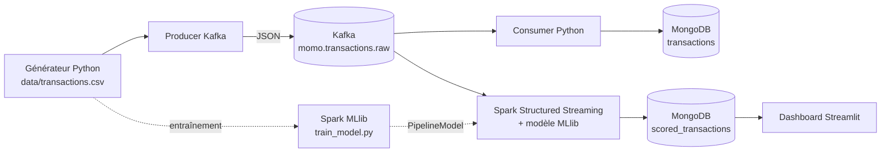

# Architecture

## Contrat d'interfaces
| Interface | Format |
|---|---|
| Topic Kafka | `momo.transactions.raw`, clé = `transaction_id`, valeur = JSON (champs de `schema.FIELDS`) |
| Mongo `transactions` | transactions brutes (écrit par le consumer), index unique `transaction_id` |
| Mongo `scored_transactions` | transaction + `fraud_score`, `prediction`, `risk_level`, `scored_at` (écrit par Spark) |
| Dashboard | lit uniquement `scored_transactions`, via `src/dashboard/data_access.py` |

## Pourquoi deux collections ?
Découplage : le stockage brut (historique, audit) ne dépend pas du scoring. Si le modèle change, on peut rescorer l'historique.

## Garanties
- **Idempotence** : upserts sur `transaction_id` côté consumer et côté Spark (rejeu sans doublon).
- **Pas de décalage train/serve** : `add_features` est partagée entre l'entraînement et le streaming.
- **Déséquilibre des classes** : pondération des classes, métrique AUC-PR (pas l'accuracy).
- **Split temporel** : on entraîne sur le passé et on teste sur le futur.

## Limites assumées (à citer dans le rapport)
Mono-broker Kafka, Spark en mode local, pas de features d'historique par compte (fenêtres glissantes) : pistes d'amélioration.
